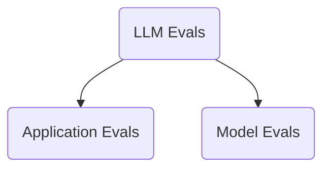

# Introduction to LLM Evaluations

## What
LLM evals are systematic repeatable tests used to judge an LLM or LLM powered system against a clear criteria.

## Evals is not metric
An evals is not a metric. An eval is the complete testing setup.

## Types

## Components level and Overall

YT [Link](https://youtu.be/cNF_MO82Qew?si=yc94gh9kpmmJl0mk)
